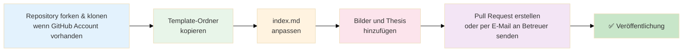

# Abschlussarbeiten Medieninformatik

Diese Web-Plattform dient zur Präsentation von Bachelor- und Masterarbeiten des Studiengangs Medieninformatik an der TH Köln, Campus Gummersbach.

## ✍️ Neue Abschlussarbeit hinzufügen

Diese Anleitung richtet sich an Studierende des Studiengangs Medieninformatik, die ihre Bachelor- oder Masterarbeit auf dieser Plattform veröffentlichen möchten. Folgen Sie den nachstehenden Schritten, um Ihre Arbeit einzureichen.



### 1. Repository forken und klonen

Erstellen Sie einen Fork des Repositories

1. Öffnen Sie https://github.com/th-koeln/mi-bachelor-abschlussarbeiten
2. Klicken Sie auf den **"Fork"**-Button oben rechts
3. Klonen Sie Ihren Fork lokal:

```bash
git clone https://github.com/IHR-USERNAME/mi-bachelor-abschlussarbeiten.git
cd mi-bachelor-abschlussarbeiten
```

**Workflow ohne GitHub-Account:**
Falls Sie keinen GitHub-Account haben, können Sie den Ordner mit allen benötigten Dateien (siehe folgende Schritte) erstellen und per E-Mail an die betreuende Person Ihrer Abschlussarbeit senden. Diese wird die Veröffentlichung für Sie übernehmen.

### 2. Template-Ordner kopieren

Kopieren Sie den Template-Ordner `_theses/_template/` und benennen Sie ihn nach dem Format:

```bash
cp -r _theses/_template _theses/YYYY-MM-DD-titel-der-arbeit
```

Beispiel: `_theses/2024-03-15-ki-gestuetzte-bildanalyse/`

### 3. Markdown-Datei anpassen

Bearbeiten Sie die `index.md` im kopierten Ordner und ersetzen Sie die Platzhalter mit Ihren Daten.

### 4. Dateien hinzufügen

- **Vorschaubild**:,
  - **Format**: JPEG (.jpg/.jpeg), PNG (.png) oder WebP (.webp)
  - **Auflösung**: 1920×1080px (16:9 Format) empfohlen
  - **Dateigröße**: Maximal 300 KB für optimale Ladezeiten
  - **Dateiname**: `teaser-image.jpg` (oder .png/.webp, entsprechend der `teaser_image_url` in der Markdown-Datei)
- **Ausarbeitung**: `thesis_vorname-nachname_titel-der-arbeit.pdf` (PDF-Datei der Abschlussarbeit)

### 5. Pull Request erstellen

```bash
# Änderungen committen
git add _theses/2024-03-15_vorname-nachname/
git commit -m "Add thesis: Titel der Arbeit"
git push origin main
```

Anschließend:
1. Öffnen Sie Ihren Fork auf GitHub
2. Klicken Sie auf **"Contribute"** → **"Open Pull Request"**
3. Beschreiben Sie kurz Ihre Änderungen
4. Senden Sie den Pull Request ab

**Alternative ohne GitHub-Account:**  
Senden Sie den kompletten Ordner `2024-03-15_vorname-nachname` mit allen Dateien per E-Mail an die betreuenden Personen Ihrer Abschlussarbeit.

## 💻 Installation & Entwicklung

Eine ausführliche Anleitung zur Installation und Entwicklung finden Sie in der [Developer Dokumentation](DEVELOPER.md).

## 🌐 API-Endpunkte

Informationen zu den verfügbaren API-Endpunkten finden Sie in der [Developer Dokumentation](DEVELOPER.md#-api-endpunkte).


## 📄 Lizenz

MIT License - siehe [LICENSE](LICENSE) Datei

## 📞 Kontakt

Bei Fragen oder Anmerkungen wenden Sie sich bitte an [Volker Schaefer](https://www.th-koeln.de/personen/volker.schaefer/).

Bei Fehlern oder Verbesserungsvorschlägen können Sie auch gerne ein [Issue auf GitHub erstellen](https://github.com/th-koeln/mi-bachelor-abschlussarbeiten/issues/new).  

---

[TH Köln Campus Gummersbach](https://www.th-koeln.de/hochschule/campus-gummersbach_76496.php) | [Medieninformatik Bachelor & Master](https://www.medieninformatik.th-koeln.de)
